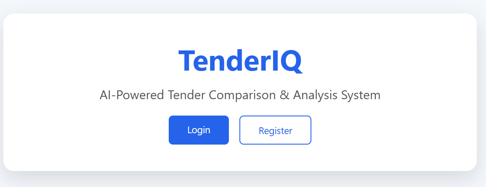
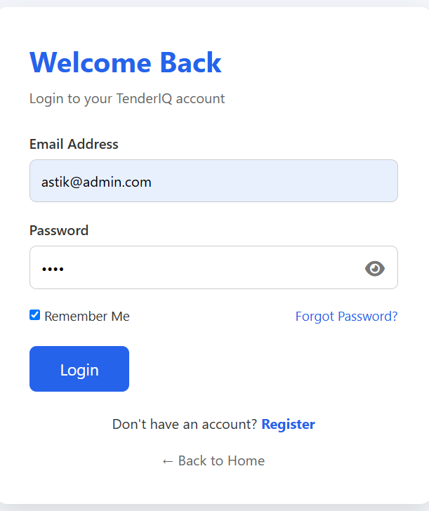
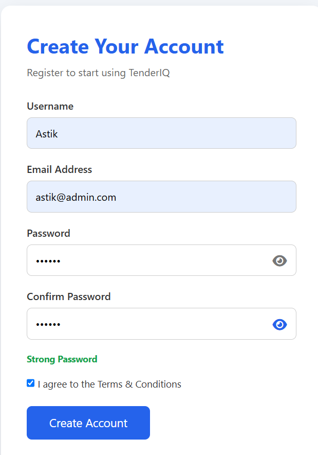
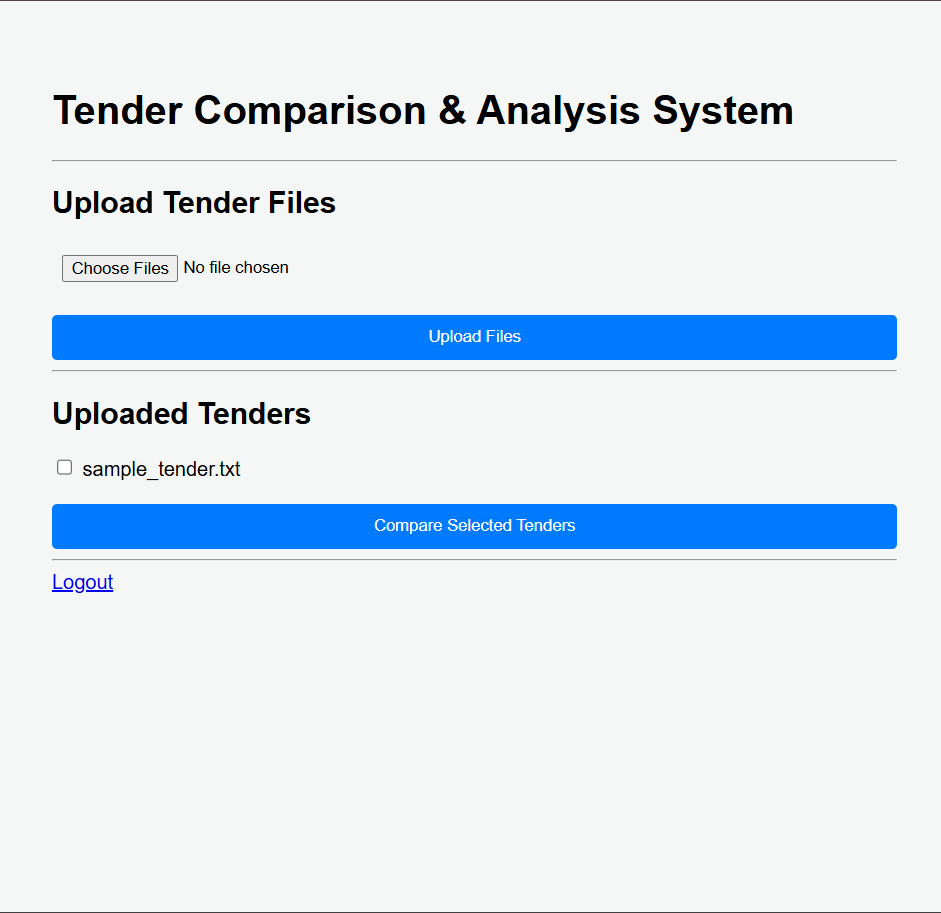
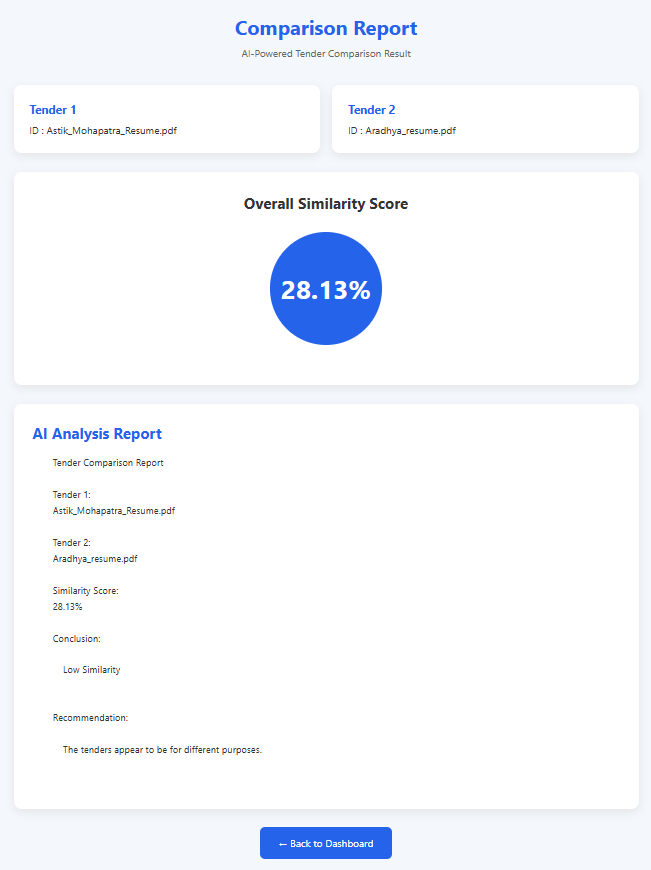
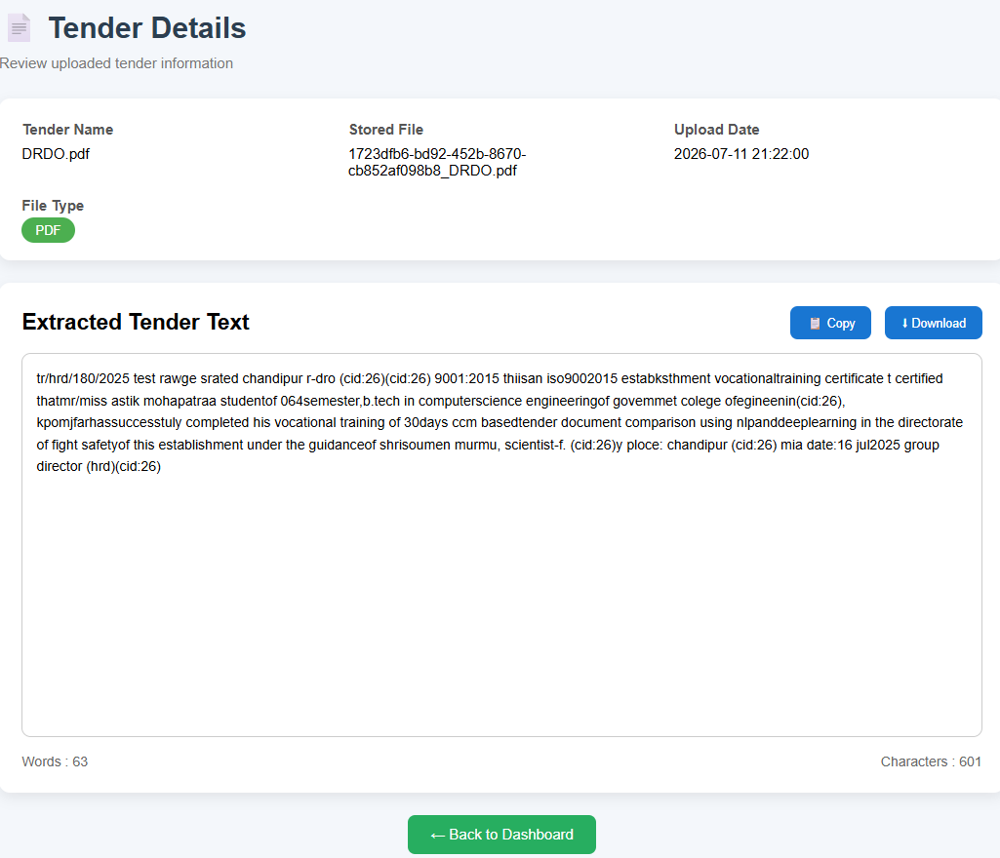

# 🚀 TenderIQ - AI-Powered Tender Comparison & Analysis System

<p align="center">


</p>

---

# 📖 Overview

TenderIQ is an **AI-powered Tender Comparison & Analysis System** designed to automate the process of evaluating multiple tender documents.

Instead of manually reading hundreds of pages, users can upload multiple tender documents and allow the system to extract text, compare documents, analyze similarities, and generate intelligent recommendations.

The project combines **Backend Engineering**, **Natural Language Processing (NLP)**, and **Machine Learning** to simplify tender evaluation for procurement teams and organizations.

> **Project Status:** 🚧 Currently Under Active Development

---

# 🎯 Problem Statement

Organizations often receive multiple tender documents from different vendors.

Manual comparison is:

- Time-consuming
- Error-prone
- Difficult to scale
- Inefficient for large documents

TenderIQ automates this workflow by extracting document content and providing AI-assisted comparison and recommendations.

---

# ✨ Features

## 🔐 Authentication

- User Registration
- Secure Login
- Logout
- Session Management
- Password Encryption using Bcrypt

---

## 📂 Tender Management

- Upload Multiple Tender Documents
- PDF Support
- DOCX Support
- TXT Support
- MySQL Database Integration
- Document Storage

---

## 📄 Document Processing

- Automatic Text Extraction
- Text Cleaning
- Preprocessing
- Document Parsing

---

## 🤖 AI-Powered Comparison

Current Features

- Compare Multiple Documents
- Similarity Analysis
- Comparison Report
- Recommendation Generation

Upcoming

- Semantic Search
- Clause Matching
- LLM-based Analysis
- Intelligent Ranking

---

# Screenshots

## Home Page



---

## Login Page



---

## Registration Page



---

## Dashboard



---

## Comparison Report



---

## View Tenders


---

# ⚙ System Workflow

```
User Login
      │
      ▼
Upload Tender Documents
      │
      ▼
Extract Text
      │
      ▼
Preprocess Documents
      │
      ▼
Compare Tender Files
      │
      ▼
Generate Similarity Score
      │
      ▼
AI Recommendation
      │
      ▼
Comparison Report
```

---

# 🏗 Project Architecture

```
TenderIQ/

│── app.py
│── config.py
│── requirements.txt
│── README.md

├── backend/
│   ├── models/
│   ├── routes/
│   ├── services/
│   └── utils/

├── database/

├── static/

├── templates/

├── uploads/

├── tests/
```

---

# 💻 Tech Stack

## Backend

- Python
- Flask

## Database

- MySQL
- PyMySQL

## Authentication

- Bcrypt

## Document Processing

- pdfplumber
- docx2txt

## Machine Learning

- Scikit-learn
- Sentence Transformers
- Transformers
- PyTorch
- NumPy

## Frontend

- HTML
- CSS *(Basic UI - Under Improvement)*
- JavaScript *(Currently Minimal)*

---

# 📦 Requirements

```
Flask
python-dotenv
PyMySQL
bcrypt
pdfplumber
docx2txt
scikit-learn
sentence-transformers
transformers
torch
numpy
requests
```

Or install directly

```bash
pip install -r requirements.txt
```

---

# 🚀 Installation

## Clone Repository

```bash
git clone https://github.com/Astik97/TenderIQ.git

cd TenderIQ
```

---

## Create Virtual Environment

Windows

```bash
python -m venv venv

venv\Scripts\activate
```

Linux

```bash
python3 -m venv venv

source venv/bin/activate
```

---

## Install Dependencies

```bash
pip install -r requirements.txt
```

---

## Configure Environment Variables

Create

```
.env
```

Example

```
MYSQL_HOST=localhost

MYSQL_USER=root

MYSQL_PASSWORD=your_password

MYSQL_DATABASE=tenderiq

SECRET_KEY=your_secret_key
```

---

## Import Database

Import

```
database/schema.sql
```

into MySQL.

---

## Run Project

```bash
python app.py
```

Open

```
http://127.0.0.1:5000
```

---

# 📊 Current Development Status

## ✅ Completed

- Flask Backend
- User Authentication
- Session Management
- MySQL Integration
- Multi-file Upload
- PDF Processing
- DOCX Processing
- TXT Processing
- Document Storage
- Basic Similarity Analysis
- Comparison Report

---

## 🚧 In Progress

- NLP Pipeline
- AI Recommendation Engine
- Clause-Level Comparison
- Semantic Search
- Report Optimization

---

## 🔮 Future Roadmap

- Docker Deployment
- AWS Deployment
- REST API
- JWT Authentication
- OCR for Scanned PDFs
- Admin Dashboard
- Multi-user Support
- PDF Report Export
- Enterprise Deployment
- LLM Integration
- Role-Based Access Control

---

# 🔒 Security

- Password Hashing using Bcrypt
- Session-based Authentication
- Environment Variables
- SQL Injection Protection
- Secure Database Connectivity

---

# 🧪 Testing

Current test modules include

- Text Extraction
- Document Processing
- Similarity Functions

Additional automated testing will be added in future releases.

---

# 🤝 Contributing

Contributions, suggestions, and feedback are always welcome.

Feel free to fork the repository and submit a pull request.

---

# 👨‍💻 Author

**Astik Mohapatra**

🎓 B.Tech – Computer Science & Engineering

Government College of Engineering, Keonjhar

**Target Roles**

- Python Developer
- Flask Developer
- Backend Developer
- AI Backend Developer

📧 astikm7007@gmail.com

🔗 LinkedIn

https://linkedin.com/in/astik-mohapatra

🔗 GitHub

https://github.com/Astik97

---

# ⭐ Support

If you found this project useful, please consider giving it a ⭐ on GitHub.

Your support motivates future development of TenderIQ.

---

## 📌 Disclaimer

This project is currently under active development. New AI capabilities, REST APIs, Docker support, cloud deployment, and advanced NLP features will be added in future releases.